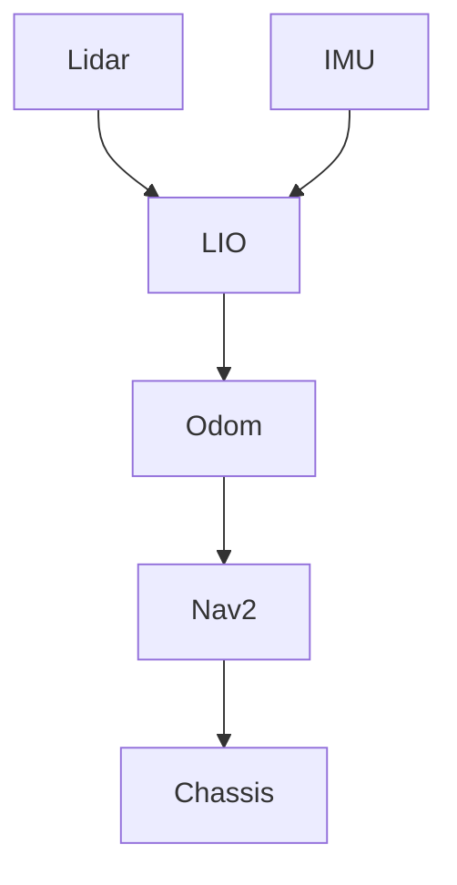

> **当前入口提示（2026-10-07 整理时添加，正文为用户原始任务书，未改动）**：
> 本文是最初的架构侦察与迁移任务书，文中提到的目录树、文档清单（如 `gap_analysis.md`、
> `s0_baseline.md`、`implementation_handoff.md`）与“本阶段不要实施”等表述是当时状态。
> 当前阶段、文档导航与任务入口见 [docs/README.md](docs/README.md)；
> 已实施内容见 [实施报告](docs/migration/implementation_report.md)；下一任务见
> [实车影子接入交接](docs/migration/real_robot_handoff.md)。历史资料在 [docs/archive/](docs/archive/README.md)。

你现在负责一个较大型的 ROS2 机器人导航工程迁移项目。

请先不要急于修改导航核心代码。本任务的目标是：

1. 完整理解现有 RM 哨兵导航代码；
2. 完整理解本地 SCAN-Planner 代码；
3. 建立一个后续适合 Codex / DeepSeek Harness 长期协作和维护的工程文档体系；
4. 分析 Navigation2 与 SCAN-Planner 在当前项目中的职责关系；
5. 给出后续迁移方案，但本阶段不要正式实施导航架构替换。

---

# 0. Local repositories

本任务涉及多个本地仓库。

请先确认并阅读以下目录。

## Current RM navigation repository

```text
../VI_26_Sentry
```
这是当前实际使用的 ROS2 哨兵导航工程。

---

## SCAN-Planner repository

```text
../../SCAN-Planner-Ros2
```

这是准备适配进入当前系统的 SCAN-Planner 仓库。

如果该仓库包含多个 branch，请重点分析：

```text
main
ros2-community
```

还有一个ROS1版本的仓库，路径为../../SCAN-Planner
里面包含我的许多注释，希望能够帮助你理解SCAN-Planner实现逻辑

---

# 1. Important working rule

这个任务目前属于：

```text
ARCHITECTURE RECONNAISSANCE
```

而不是：

```text
IMPLEMENTATION
```

因此：

## 允许

- 阅读代码
- grep / rg 搜索
- 查看 CMakeLists.txt
- 查看 package.xml
- 查看 launch
- 查看 yaml
- 查看 msg / srv / action
- 查看 git history
- 查看 ROS2 node/topic/frame 相关代码
- 创建 docs 文档
- 创建 AGENTS.md
- 创建 migration 文档
- 创建架构说明

## 暂时不允许

不要修改：

- 导航算法逻辑
- 定位算法
- LIO
- 点云配准算法
- SCAN-Planner 核心算法
- 底盘控制协议
- cmd_vel 生成逻辑
- TF 逻辑
- Nav2 配置
- 原有 topic 名称
- 原有 message 类型

除非修改仅用于添加工程文档。

本阶段不要尝试“先改起来再说”。

---

# 2. Project background

这是一个 ROS2 全向移动机器人导航系统。

当前系统主要基于 Navigation2，并包含类似以下数据流：

```text
LiDAR + IMU
     ↓
LIO / odometry
     ↓
odom -> base_link
     ↓
global localization / map matching
     ↓
map -> odom
     ↓
current robot pose
     ↓
Navigation2
     ↓
global planning
     ↓
local planning / control
     ↓
velocity command
     ↓
chassis
```

但上面只是项目背景说明。

你必须以实际代码为准。

如果实际代码与上述描述不一致，应当：

```text
以代码为准
```

不要为了符合这段描述而强行解释代码。

---

# 3. Target direction

未来希望研究：
用SCAN-Planner以及其他开源算法来完全替代Nav2，用于完成全向机器人的3D导航，而非Nav2的2D导航。

目前希望研究：
采用SCAN-Planner能否完成实车的路径规划，以及把速度发送到底盘。

---

# 4. First task: inspect repository structure

首先完整阅读当前 RM 导航仓库的目录结构。

不要只执行一次 tree 就结束。

重点定位以下内容。

## ROS packages

找出所有 ROS2 packages。

记录：

- package name
- path
- purpose
- dependencies

---

## Nodes

找出主要 ROS2 node。

对于每一个关键 node，至少记录：

```text
node name
source file
package
subscriptions
publishers
services
actions
parameters
TF usage
high-level responsibility
```

---

## Launch

分析所有重要 launch 文件。

梳理：

```text
哪个 launch
    ↓
启动哪个 launch
    ↓
启动哪些 node
```

形成 launch hierarchy。

例如：

```text
bringup.launch.py
    ├── localization.launch.py
    ├── navigation.launch.py
    │      ├── planner_server
    │      ├── controller_server
    │      └── ...
    └── chassis.launch.py
```

实际内容必须根据仓库生成。

---

# 5. Reconstruct current navigation pipeline

请从代码中完整重建：

```text
Current Navigation Architecture
```

重点回答：

## Localization

机器人位置来自哪里？

例如：

```text
LiDAR
IMU
     ↓
LIO
     ↓
odom pose
```

以及：

```text
prior map
current point cloud
     ↓
registration
     ↓
global localization
```

但必须确认实际实现。

---

## TF

完整分析：

```text
map
odom
base_link
lidar
imu
```

以及所有其他相关 frame。

对于每条重要 TF：

```text
parent
child
publisher
source file
pose source
static / dynamic
frequency if identifiable
```

例如：

```text
map -> odom
odom -> base_link
base_link -> lidar
```

不要仅仅根据常见 ROS 习惯进行猜测。

必须找到代码依据。

无法确认的内容写：

```text
UNKNOWN
```

---

# 6. ROS communication inventory

生成完整 ROS 接口表。

至少覆盖：

## Topics

对于每个关键 topic：

```text
topic name
message type
publisher
subscriber
frame_id if applicable
QoS if identifiable
purpose
source
```

特别关注：

```text
PointCloud2
Odometry
Pose
PoseStamped
Path
Twist
TwistStamped
LaserScan
IMU
goal
trajectory
cmd_vel
```

以及项目自定义消息。

---

## Services

记录：

```text
service
type
server
client
purpose
```

---

## Actions

尤其检查 Nav2：

```text
NavigateToPose
FollowPath
ComputePathToPose
```

以及项目自定义 action。

---

# 7. Analyze current Navigation2 usage

不要简单说“使用 Nav2”。

需要分析当前项目到底使用了 Nav2 的哪些组件。

例如：

```text
bt_navigator
planner_server
controller_server
behavior_server
waypoint_follower
velocity_smoother
global_costmap
local_costmap
map_server
lifecycle_manager
```

实际有哪些就分析哪些。

对于每个组件记录：

```text
是否使用
用途
配置文件
输入
输出
是否与 SCAN-Planner 存在职责重叠
```

然后分类：

```text
KEEP

POTENTIALLY REPLACE

LIKELY REMOVE LATER

UNCERTAIN
```

本阶段不要真正删除。

---

# 8. Analyze omnidirectional chassis assumptions

当前机器人是：

```text
omnidirectional mobile robot
```

这是非常重要的约束。

请检查：

- 当前 controller 是否允许 vx / vy / wz；
- 是否存在差速机器人假设；
- Nav2 controller 配置；
- MPPI 或其他 controller 参数；
- 底盘最终接受的控制格式；
- velocity limit；
- acceleration limit；
- angular velocity limit。

建立：

```text
planner/controller
      ↓
command conversion
      ↓
chassis
```

的完整链路。

---

# 9. Analyze SCAN-Planner

接下来阅读本地 SCAN-Planner 仓库。

不要只阅读 README。

需要阅读：

```text
source code
launch files
config files
package.xml
CMakeLists
message interfaces
node entry points
planner implementation
mapping implementation
trajectory generation
collision checking
command output
```

如果同时存在：

```text
main
ros2-community
```

请使用ROS2版本

---

# 10. SCAN-Planner architecture

重建 SCAN-Planner 的数据流。

例如：

```text
point cloud
odometry
goal / reference path
        ↓
local map
        ↓
collision-aware planning
        ↓
trajectory
        ↓
command
```

但最终架构必须以代码为准。

重点回答：

### Input

SCAN-Planner 需要什么？

例如：

```text
PointCloud2?
Odometry?
Pose?
Path?
Goal?
```

---

### Coordinate frames

它假设：

```text
map?
odom?
world?
base_link?
lidar?
```

---

### Output

它输出：

```text
trajectory?
path?
velocity?
control command?
```

---

### Robot model

检查是否假设：

```text
differential drive
Ackermann
quadruped
holonomic
generic SE(2)
```

不要凭 README 推断。

---

# 11. Compare SCAN-Planner and current stack

创建：

```text
docs/migration/interface_mapping.md
```

内容至少包含：

| SCAN requirement | Current RM source | Type | Compatible | Adapter |
|---|---|---|---|---|

例如：

```text
odometry
point cloud
goal
reference path
TF
robot velocity
robot footprint
trajectory output
```

Compatibility 使用：

```text
DIRECT

MINOR_ADAPTATION

MAJOR_ADAPTATION

MISSING

UNKNOWN
```

---

# 12. Determine responsibility boundaries

重点回答：

```text
SCAN-Planner 到底应该替代什么？
```

分析至少三种方案。

---

## Architecture A

```text
SCAN-Planner completely replaces Nav2 planning/control
```

分析：

```text
advantages
disadvantages
required work
risks
```

---

## Architecture B

```text
Nav2 global planner
      ↓
global path
      ↓
SCAN-Planner local planner
      ↓
chassis
```

分析同样内容。

---

## Architecture C

根据代码提出你认为合理的其他组合。

但不要直接宣布最终答案。

使用：

```text
Recommended candidate architecture
```

并说明依据。

---

# 13. Create long-term documentation structure

在当前 RM 主仓库根目录创建：

```text
AGENTS.md
```

并创建：

```text
docs/
├── architecture/
│   ├── current_navigation.md
│   ├── scan_planner.md
│   └── target_architecture.md
│
├── interfaces/
│   ├── ros_topics.md
│   ├── ros_services_actions.md
│   ├── tf_tree.md
│   └── chassis_interface.md
│
├── migration/
│   ├── plan.md
│   ├── interface_mapping.md
│   ├── gap_analysis.md
│   ├── decisions.md
│   └── progress.md
│
└── testing/
    └── validation_plan.md
```

如果目录已经存在，合理合并。

不要破坏已有项目文档。

---

# 14. AGENTS.md design

AGENTS.md 不应该是一篇巨大的百科全书。

它应该作为：

```text
repository map
+
engineering rules
+
important commands
```

包含以下内容。

---

## Project overview

说明这是：

```text
ROS2 omnidirectional robot navigation system
```

以及目前处于：

```text
Nav2 → SCAN-Planner migration
```

---

## Important documentation

列出：

```text
docs/architecture/current_navigation.md
docs/architecture/scan_planner.md
docs/architecture/target_architecture.md
docs/interfaces/ros_topics.md
docs/interfaces/tf_tree.md
docs/migration/plan.md
docs/migration/decisions.md
```

告诉未来 Agent：

```text
修改导航架构前必须先阅读这些文件。
```

---

# 15. Engineering rules

写入以下规则。

## Minimal change principle

```text
Prefer minimal changes.

Do not perform broad refactoring unless explicitly required.
```

---

## Adapter-first principle

SCAN-Planner 初次适配：

```text
prefer adapters
```

而不是直接修改：

```text
SCAN-Planner core algorithm
```

---

## Preserve existing interfaces

默认不要修改：

```text
topic names
message types
TF semantics
frame names
chassis protocol
```

除非有明确原因。

---

# 16. Robotics safety rules

必须写入 AGENTS.md。

任何涉及：

```text
cmd_vel
trajectory command
TF
localization
odometry
collision checking
velocity
acceleration
chassis control
```

的修改：

都不能因为：

```text
colcon build succeeded
```

就认为完成。

必须先经过：

```text
static verification
        ↓
build
        ↓
simulation / rosbag
        ↓
visualization
        ↓
controlled robot test
```

真实机器人测试属于最后阶段。

---

# 17. TF rules

任何修改 TF 的任务都必须记录：

```text
parent frame
child frame
publisher
pose source
frequency
reason
```

禁止 silent TF change。

尤其：

```text
map
odom
base_link
lidar
```

不得随意改变含义。

---

# 18. ROS interface rules

修改 topic 时必须记录：

```text
topic
message type
publisher
subscriber
QoS
frame_id
timestamp source
frequency if relevant
```

禁止因为“命名更好看”而随意 rename。

---

# 19. Dependency rules

不要为了修复一个错误随意：

```text
apt install
pip install
git clone
```

如果发现新依赖：

先记录：

```text
dependency
reason
where used
whether already available
```

然后再决定是否安装。

---

# 20. Build instructions

自动识别当前仓库标准编译方法。

例如：

```bash
colcon build
```

或者：

```bash
colcon build --symlink-install
```

如果存在：

```text
setup scripts
Docker
workspace overlay
custom build scripts
```

也需要记录。

最终写进 AGENTS.md。

---

# 21. Create target architecture document

创建：

```text
docs/architecture/target_architecture.md
```

这一阶段不要把 target architecture 当作最终结论。

使用：

```text
PROPOSED ARCHITECTURE
```

重点描述：

```text
sensors
↓
localization
↓
TF
↓
global planning if retained
↓
SCAN-Planner
↓
command adapter
↓
chassis
```

明确：

```text
current component
planned component
interface
migration status
```

---

# 22. Migration plan

创建：

```text
docs/migration/plan.md
```

建议按照如下阶段。

---

## Phase 0

Repository understanding.

Goal:

```text
existing system is fully documented
```

---

## Phase 1

SCAN-Planner standalone reproduction.

Goal：

确认 SCAN-Planner 本地环境可以：

```text
build
launch
receive expected input
```

不连接真实机器人控制。

---

## Phase 2

Sensor / odometry integration.

接入：

```text
point cloud
odometry
TF
```

但不要输出到底盘。

---

## Phase 3

Planner output visualization.

例如：

```text
RViz
Path
trajectory
markers
```

验证：

```text
trajectory direction
frame
timestamp
collision avoidance
```

---

## Phase 4

Command adapter.

将 SCAN-Planner 输出转换为当前底盘接口。

仍优先：

```text
simulation / rosbag
```

---

## Phase 5

A/B testing.

保留旧 Nav2 路径。

能够切换：

```text
Nav2
SCAN-Planner
```

用于对比。

---

## Phase 6

Controlled robot testing.

低速、受控环境实车。

---

## Phase 7

Cleanup.

只有在 SCAN-Planner 稳定之后：

才分析删除：

```text
obsolete Nav2 components
```

---

# 23. Gap analysis

创建：

```text
docs/migration/gap_analysis.md
```

重点分析：

```text
ROS version
message compatibility
TF
point cloud frame
timestamp
QoS
odometry definition
goal input
reference path
robot geometry
holonomic motion
trajectory representation
command representation
velocity limits
collision model
map representation
```

---

# 24. Architecture decisions

创建：

```text
docs/migration/decisions.md
```

采用简单 ADR 风格。

例如：

```text
ADR-001
Decision:
Keep current localization system during initial SCAN integration.

Reason:
Planner migration should not be coupled with localization migration.
```

又例如：

```text
ADR-002
Decision:
Do not remove Navigation2 during early integration.

Reason:
Maintain rollback and A/B testing capability.
```

不要编造 decision。

只能记录：

```text
已经确认的
```

或者：

```text
proposed
```

两者必须区分。

---

# 25. Evidence requirements

这是本任务非常重要的一条规则。

所有架构结论尽量提供代码依据。

例如：

不要只写：

```text
This node publishes odometry.
```

应写：

```text
Confirmed from:
package_x/src/xxx.cpp
publisher creation at ...
```

无需把每一行代码全部复制进文档。

但需要提供：

```text
file path
relevant class/function/config
```

使后续开发者可以快速复查。

---

# 26. Confidence classification

对于重要结论，建议使用：

```text
CONFIRMED

INFERRED

UNKNOWN
```

例如：

```text
CONFIRMED:
odom -> base_link is published by XXX node.

INFERRED:
this path appears to be used as Nav2 global reference.

UNKNOWN:
whether this topic is still used during competition runtime.
```

不要把推测包装成事实。

---

# 27. Do not over-document

不要把：

```text
每个变量
每个普通函数
每个 include
```

都写进文档。

重点记录：

```text
architecture
interfaces
data flow
dependencies
decision points
migration risks
```

目标是让未来 Agent 和开发者：

```text
10~20 分钟可以理解整个导航系统结构
```

而不是制造几万行无用文档。

---

# 28. Required diagrams

所有架构文档尽量加入 Mermaid。

例如：



最终内容必须根据实际系统生成。

至少包括：

```text
current architecture
launch hierarchy
TF tree
ROS data flow
proposed target architecture
```

---

# 29. Git discipline

执行任务前先检查：

```bash
git status
```

不要覆盖用户当前未提交修改。

如果存在用户正在进行的修改：

```text
preserve them
```

不要 reset。

不要 checkout 覆盖。

不要执行：

```bash
git reset --hard
git clean -fd
```

---

# 30. End-of-task verification

完成文档后：

重新检查：

```bash
git diff
```

确认：

除：

```text
AGENTS.md
docs/
```

之外，没有修改现有工程代码。

如果发生其他修改，恢复这些非文档修改。

---

# 31. Final response format

任务完成后不要只说：

```text
Done.
```

请提供一个简洁但完整的总结。

格式如下：

# 1. Current architecture

总结当前导航主链路。

---

# 2. Key packages

列出重要 package 及职责。

---

# 3. Navigation2 usage

说明当前 Nav2 到底承担什么。

---

# 4. SCAN-Planner architecture

说明主要输入、输出和算法职责。

---

# 5. Main compatibility findings

列出：

```text
direct compatibility
minor adaptation
major adaptation
missing interfaces
```

---

# 6. Biggest migration risks

重点包括：

```text
TF
odometry
holonomic chassis
point cloud
trajectory/control interface
Nav2/SCAN responsibility overlap
```

---

# 7. Proposed architecture

给出 Mermaid 或文本图。

---

# 8. Files created

列出创建：

```text
AGENTS.md
docs/...
```

---

# 9. Unknowns

明确哪些事情无法仅通过静态代码阅读确认。

---

# 10. Recommended next task

最后只推荐：

```text
一个
```

最合理的下一阶段任务。

不要直接开始执行下一阶段。

---

# Core principle

本阶段的最终目标不是：

```text
让 SCAN-Planner 跑起来
```

而是：

```text
让当前系统的架构、接口和 SCAN-Planner 的接入边界变得明确、可验证、可维护。
```

如果阅读过程中发现当前系统与上述假设明显不一致：

优先相信：

```text
actual repository code
```

并在文档中说明。