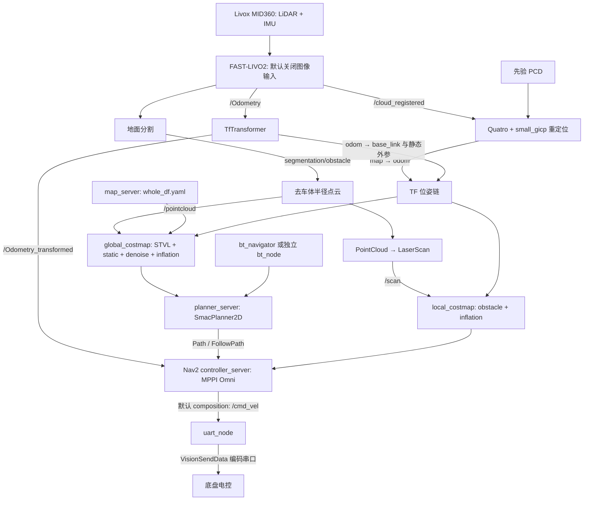
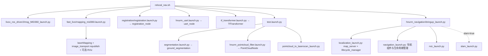

# 当前 RM 导航架构

基线与证据 ID 见 [入口](../README.md)。本文件只描述 RM **main 7dfe71a**。CONFIRMED 分源码事实与用户验证：用户已确认当前配置能通过 RViz 2D goal 规划并驱动实车。本轮不重复运行；具体启动命令/参数快照留待实施归档，不能据静态疑点否定已有验证。

## 主数据流

证据：R1–R14；`hnurm_bringup/launch/test.launch.py`；感知包的 launch、源码和参数。图中的 Path 包括 action 结果/请求，不代表主链靠独立 Path topic 连接。

## 启动层级

默认 `slam=False`、`use_composition=True`、`use_sim_time=false`、`map=whole_df.yaml`、`params_file=nav2_params.yaml`。定位 launch 名虽含 localization，但 AMCL 的两条启动分支均注释掉，只有 map_server 被生命周期管理。不要根据 YAML 中的 AMCL 参数宣称它在使用。

其他入口不能混为同一配置：

| 入口 | 静态行为/限制 |
|---|---|
| `norelocal_nav.sh` | 与 relocal 路线类似，但不启动 registration；map→odom 依靠 TfTransformer 初始值 |
| `navigation.sh` | 旧 ROS1 bridge + Docker LIVO 流程，并引用 `/home/rm/decision_test/install`；不是本地 ROS2 main 的统一入口 |
| `full.sh` | 由 small1.sh 改名；保留 ROS1 bridge/Docker/外部 decision_test 的另一套启动流程，不推定其就是用户验证入口 |
| `mapping.sh` | 建图入口；与导航运行分开阅读 |
| `hnurm_bringup/launch/bringup.launch.py` | 当前仅保留 namespace + 延时 UART 启动，不再启动视觉或 robot_state_publisher；并非完整导航总入口 |
| `nav_with_mapping.launch.py` | no_amcl bringup + segmentation + laserscan + online_async；没有启动 pointcloud_filter，不能独立保证 `/pointcloud` 链接完整 |
| `nav_with_icp.launch.py` | 引用本仓库未找到的 static_transform.launch.py、pointcloud_downsampling、hnurm_pointcloud 等，视为历史/外部依赖入口 |
| `bringup_launch_debug.py`、`bringup_no_amcl_launch.py` | 替代入口，非 R1 默认选择；不能把其参数并入默认配置 |
| `hnurm_decision.launch.py` | 独立启动 `decision_node`（ROS 名 `bt_node`）；R1 的决策启动命令被注释 |

## 定位实际语义

1. `FAST-LIVO2/config/mid360.yaml`：lidar_en=1、img_en=0、imu_en=true。因此默认是 LiDAR+IMU 路线，不因项目名含 VIO 就认定相机参与。
2. R6 `publish_odometry()`：`/Odometry` 为 `camera_init → aft_mapped`，pose 来自 `_state`，时间戳是发布时 `now()`。函数只填写 pose，源码对 `odomAftMapped` 未找到 twist 赋值，不能当成可靠速度反馈。
3. R7 `odom_callback()` 将上述 pose 解释为 odom→base_link，另发这条 TF；并通过 `lookupTransform("lidar_link","base_footprint")` + `doTransform` 生成 `/Odometry_transformed`。迁移时需重新核对该坐标契约，不能仅凭静态疑点修改已验证的现有链，详见 [TF](../interfaces/tf_tree.md)。
4. R8 用 `/cloud_registered` 累积点云对先验 PCD 做 Quatro 初始配准、small_gicp 跟踪；结果 `T_target_source` 用作 map→odom。没有替换 LIO。
5. registration 约 58.8 Hz 广播 TF，373 ms 定时发布状态；TfTransformer 收到 state_for_tf=true 后停止自己的 map→odom，回调锁存后不恢复。启动交接及定位有效性须运行验证。

新增输入候选：`mid360.yaml` 已开启 `uav.imu_rate_odom=true`，`/LIVO2/imu_propagate` 填写传播 pose 和世界系线速度，使用最新 IMU stamp；4 ms timer 不代表实测 250 Hz（受新 IMU/初始化条件限制）。其 header=`world`、child 未填写，不能直接当 TF 中已有 world；适配前核对状态原点与坐标关系。另开启 dense_map_en，LIO RViz 默认关闭，path header stamp 每次更新。

## 关键节点责任表

完整话题/QoS 见 [Topics](../interfaces/ros_topics.md)，服务/actions 见对应文档。`—` 表示在所读关键实现未见业务服务/action，不包括 ROS 参数服务。

| ROS 名/组件 | package / 源码 | 输入 → 输出 | 参数、TF、业务 S/A |
|---|---|---|---|
| livox_lidar_publisher | livox_ros_driver2 / launch/msg_MID360_launch.py、src/lddc.cpp | 设备 → /livox/lidar、/livox/imu | xfer_format、frame_id；驱动细节以实际参数覆盖为准 |
| laserMapping | fast_livo / src/LIVMapper.cpp | lidar、imu、可选图像 → /Odometry、/cloud_registered、/path | common、extrin_calib、imu、lio；camera_init→aft_mapped；— |
| relocation_node | registration / src/registration_node.cpp | 注册点云、PCD → map→odom、状态、地图 | pcd_file、downsampled_pcd_file、gicp_*、quatro_*；Trigger 服务 |
| TfTransformer | hnurm_bringup / src/tf_transformer_node.cpp | Odometry、initialpose、串口、重定位状态 → 转换里程计/TF | extrinsic.yaml；查询/发布见 TF 表；— |
| ground_segmentation | linefit_ground_segmentation_ros / src/ground_segmentation_node.cc | cloud_registered → ground、obstacle | segmentation_params.yaml；可选重力对齐 TF；— |
| PointCloudNode | pointcloud_filter / src/pointcloud_filter_node.cpp | obstacle、Odometry → pointcloud | default.yaml；按消息 stamp 查 base_footprint←输入 frame，输出该系坐标；半径和高度过滤；— |
| pointcloud_to_laserscan | 同名包 / src/pointcloud_to_laserscan_node.cpp | pointcloud → scan | target_frame=base_footprint；高度/角度/range 过滤；— |
| bt_node | hnurm_ul_decision / src/decision.cpp、PubRobotStatus.cpp | 裁判/目标/footprint → BT goals、控制策略 | param/params.yaml + simple_test.xml；Nav2 actions/clear costmap |
| uart_node | hnurm_uart / src/uart_node.cpp、src/main.cpp | Twist/视觉/策略 → 串口；串口 → VisionRecvData | twist_topic 等；TF 广播器虽创建，所读接收路径发送代码已注释；SetMode client |

## Navigation2 职责与候选去留

配置均来自 R5，装配来自 R3/R4。分类为 **迁移建议**，不是已实施删除。

| 组件 | 是否装配及生命周期 | 输入 → 输出 / 用途 | 与 SCAN 重叠及分类 |
|---|---|---|---|
| map_server | 启动且管理 | YAML/PGM → OccupancyGrid | SCAN 不直接用 2D map；过渡 KEEP，完全迁移后候选移除 |
| amcl | 两分支均注释 | 不作为当前位姿源 | 不需用 SCAN 替代；UNCERTAIN（历史配置） |
| planner_server | 启动且管理 | 目标 + global costmap → SmacPlanner2D Path | SCAN 的参考插值不等同全局搜索；POTENTIALLY REPLACE，需额外路线提供者 |
| controller_server | 启动且管理 | FollowPath + TF/odom + local costmap → cmd_vel | SCAN 局部轨迹/跟踪重叠；POTENTIALLY REPLACE |
| global_costmap | planner 内部 | static map + /pointcloud/STVL → 2D costmap | 有 3D 观测，但全局规划仍 2D；过渡 KEEP，后期 LIKELY REMOVE LATER |
| local_costmap | controller 内部 | /scan + TF → 滚动 2D costmap | SCAN GridMap 重叠；POTENTIALLY REPLACE |
| bt_navigator | 启动且管理 | NavigateToPose 等 → 规划/控制/恢复 actions | SCAN 无等价任务接口；UNCERTAIN，先补任务契约 |
| behavior_server | 启动且管理 | 恢复 action + costmap → 速度/状态 | SCAN 急停不覆盖恢复管理；UNCERTAIN |
| smoother_server | 两分支创建，但不在 lifecycle_nodes | 路径平滑 | 无法确认会进入 active；LIKELY REMOVE LATER |
| waypoint_follower | 两分支创建，但不在 lifecycle_nodes | 多点任务 | SCAN waypoint 模式不等价任务 action；UNCERTAIN |
| velocity_smoother | composition 创建；非 composition 注释；不在 lifecycle_nodes | cmd_vel_nav → cmd_vel | 配置限加速度不能视为已生效；UNCERTAIN，最终必须有明确执行限幅层 |
| lifecycle_manager | localization/navigation 两个 | configure/activate 等服务 | SCAN 非 lifecycle 节点；Nav2 保留期间 KEEP |

**CONFIRMED：两种 composition 分支的速度链不一致。** 默认 composition 的 controller 直接发 cmd_vel；velocity_smoother 却监听 cmd_vel_nav。非 composition 的 controller 被 remap 到 cmd_vel_nav，而 smoother 不启动。不能画成必然经过 smoother 的单一路径。

`enable_stamped_cmd_vel=true`、PositionGoalChecker、DenoiseLayer 等配置是否由本机实际 Nav2 版本支持为 UNKNOWN；UART 订阅明确是 Twist。加载 YAML 或编译包不证明运行类型匹配。

## 全向与决策耦合

实际选中 `FollowPath=MPPIController`，`motion_model=Omni`，支持 vx/vy/wz 采样；其他 FollowPath2/Omni/Omni2/Omni3 配置块没有全部列入 controller_plugins。默认 vx∈[-1,1]、|vy|≤1、|wz|≤1.5，频率 100 Hz。YAML 的 smoother 限加速度不代表物理链路落实了该限制。

`bt_node` 独立加载 Nav2 BT 插件，源码选的是 **simple_test.xml**。它直接执行 ComputePathToPose 和 FollowPath，并消费 `/global_costmap/published_footprint` 估算位置。替换 Nav2 时不能只删除 bt_navigator/两个 server，还要迁移这些调用和位姿依赖。

默认 UART launch 的 YAML 将 twist_topic 设为 `/cmd_vel`，覆盖 C++ 默认 `/cmd_vel_remap`。因此主默认路径可直接到 UART；决策的 remap 路线是另一种配置，详见 [底盘接口](../interfaces/chassis_interface.md)。
