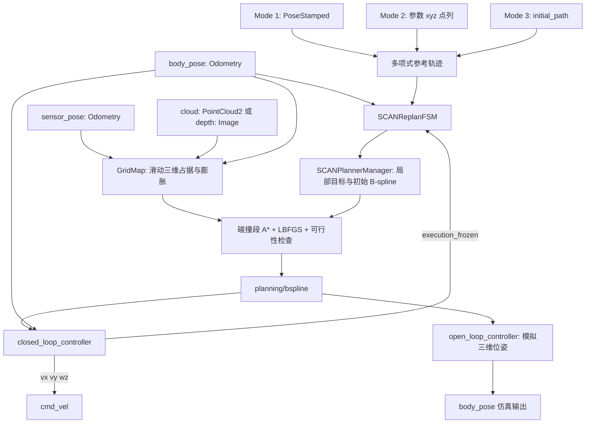
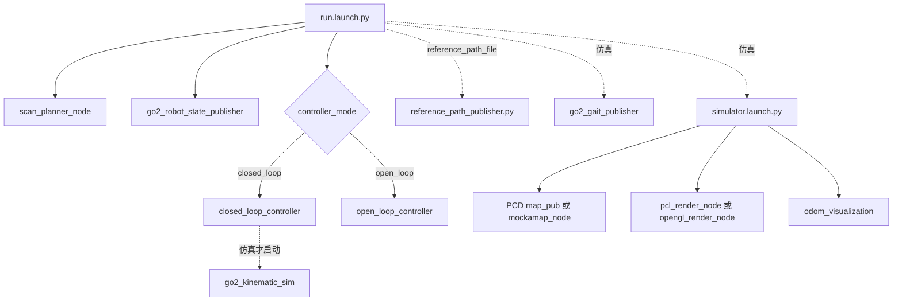

# SCAN-Planner ROS 2 架构

基线：SCAN2 main `103bce4`。证据链接 S1–S10 见 [入口](../README.md)。ROS1 注释辅助理解，ROS2 源码决定本文件结论。

## 职责与数据流

GridMap、FSM、PlannerManager 和优化库在一个 `scan_planner_node` 进程内协作；不是一套 Nav2 插件/servers。实车定位驱动不在 SCAN 仓库内。

## 从入口到算法

| 层 | 源码位置（SCAN2/src 下） | 实际作用 |
|---|---|---|
| ROS 入口 | planner/plan_manage/src/scan_planner_node.cpp | 创建节点、初始化 FSM、spin |
| FSM | plan_manage/src/scan_replan_fsm.cpp（同 planner 前缀，下同） | 100 Hz 状态推进，20 Hz 碰撞检查；INIT→WAIT_TARGET→GEN_NEW_TRAJ→EXEC_TRAJ/REPLAN_TRAJ→EMERGENCY_STOP |
| 参考轨迹 | plan_manage/src/planner_manager.cpp::planGlobalTraj/planGlobalTrajWaypoints | 对目标/waypoints 生成多项式参考；没有对全局地形图执行通路搜索 |
| 局部轨迹 | planner_manager.cpp::reboundReplan/refineTrajAlgo | 初始化采样点、B-spline 参数化、绕障优化、时间分配与最终可行性检查 |
| 地图 | plan_env/src/grid_map.cpp | lidar 射线或 depth 投影→log-odds 占据→膨胀；滑窗更新；20 Hz 更新/可视化 |
| 绕障引导 | path_searching/src/dyn_a_star.cpp::AstarSearch | 在碰撞段起终点之间搜索，用于生成 rebound 方向 |
| 优化 | bspline_opt/src/bspline_optimizer.cpp | LBFGS，平滑/碰撞/速度加速度等代价；refine 中有参考拟合代价 |
| 轨迹数学 | bspline_opt/src/uniform_bspline.cpp | De Boor 求值、导数、时间重分配 |
| 可视化 | traj_utils/src/planning_visualization.cpp | goal/global/init/optimal/A* Marker；不是控制 Path 接口 |

## 三维能力边界（CONFIRMED）

这份本地实现有三维地图和 xyz 轨迹，但**高度不是自由优化变量**：

- S3 `applyLinearZReference()` 按 XY 路径长度把局部起点/终点的高度插入初始化点。
- S6 `AstarSearch()` 只枚举 dx/dy 邻居，用 `interpolateZIndexOnSearchPlane()` 决定 z。不能因使用 Vector3i 和三维数组，就称为任意 26 邻域三维搜索。
- S7 `combineCostRebound()` / `combineCostRefine()` 的组合梯度中都有 `grad_3D.row(2).setZero()`。优化器数组有 xyz，不等于它会主动优化高度绕障。
- Mode 1 把目标 z 设成收到的初始 body_pose 高度。Mode 3 在参考路径 z 上加 `grid_map.body_height`（默认 0.4 m），按 0.5 m 三维距离降采样并保留末点，至少两个不同点。依据 `reference_path_utils.h`。
- 原生闭环只使用 XY 位置误差与 yaw，不控制 z；`go2_kinematic_sim` 保持 z 不变。
- `open_loop_controller` 直接将三维轨迹求值结果发布为模拟里程计。跨层演示成功不能证明实车爬坡、车轮接地或跟踪能力。

**用户确认的目标范围：**采用这里的参考高度 + 三维占据/局部空间避障实现，不要求自由三维规划。完整地形支撑、台阶/悬崖识别、跨层全局路线不属于当前 C 方案的必做前置；未来若扩大场景再独立评审。仍须选择已知可行场地，核对碰撞尺寸与运动安全。

## 坐标、速度与时间契约

- 默认 `grid_map.frame_id=world`；输入 callbacks 直接使用数字坐标，未按消息 frame 自动做 TF 变换。
- lidar 的 sensor_pose 与 cloud 是分别订阅，使用最新缓存 pose；没有按云时间戳同步或做 TF 插值。depth 分支使用 ApproximateTime。
- `cloud_is_world=true`：点坐标直接作为地图坐标；false：按 sensor_pose 的旋转/平移转换。即使 true 也需要 sensor_pose，射线起点不能省略。
- `need_extrinsic=true` 会再用 GridMap 源码中的固定 lidar/depth 外参。它不是读取 RM TF；RM 输入已对齐后再使用它可能重复转换。
- FSM 把 Odometry.twist.linear 直接作为规划坐标系速度。仿真器明确写入 world 速度，尽管 child_frame_id=base。适配时必须明示这个与常规 child-frame twist 不同的内部契约，不能只 remap RM Odometry。
- Bspline 消息无 Header/frame_id，只有 order、traj_id、start_time、knots、pos_pts、yaw_pts、yaw_dt。frame 必须通过接口约定保证。
- 闭环 bsplineCallback 收到新轨迹后把本地 exec_time 清零；不按消息 start_time 直接对齐执行。yaw 误差超阈值时冻结时间，并反馈 FSM 后移轨迹开始时刻。延迟、重规划和重放需要专项验证。
- `planning_visualization.cpp` 有硬编码 world，也有部分辅助函数硬编码 map；只改 grid_map.frame_id 不会统一所有显示语义。

## 机器人模型和控制

S5 `getInflateOccupancy(pos,yaw)` 在机身前后 ±offset 采样膨胀地图，近似双圆柱。默认半径 0.25 m、offset 0.18 m、上下膨胀各 0.1 m。`body_height=0.4` 是路线 z 的偏置，不可直接当成机器人完整碰撞高度。

查询方向主要来自轨迹切线（S7 `estimateSegmentYaw`、FSM `estimateYawFromSegment`），没有独立优化底盘 yaw、roll、pitch。全向横移/小陀螺时，实际机身朝向与轨迹切线可能不同，不能直接保证双圆柱包络覆盖真实外形。

闭环 S8 是“轨迹前馈 + XY 比例反馈 + yaw 比例反馈”，先将 world 速度旋转到 body，再分别限幅 vx/vy。它允许 vy，**不是差速控制器**，但也不等于朝向完全解耦的哨兵控制：yaw 误差超过 0.8 rad 时先停止平移、原地对齐，期间冻结轨迹。

| 参数 | 默认值 | 注意 |
|---|---|---|
| manager.max_vel / max_acc | 0.75 m/s / 0.5 m/s² | 轨迹约束，不能等同最终闭环指令加速度限制 |
| manager.max_jerk | 4.0 | 有加载；不能据此认定全控制链已强制限 jerk |
| max_vx / max_vy | 0.75 / 0.35 m/s | 横向限速不对称于前向 |
| max_vyaw | 1.0 rad/s | 代码还将参数上限截到 1.0 |
| kp_pos / kp_yaw | 0.8 / 1.5 | 跟踪增益 |
| finish_dist | 0.15 m | 检查平面误差 |

闭环没有显式 odometry 新鲜度超时检查（have_odom 一旦 true 保持）；仿真器的 cmd_timeout=0.3 s 是模拟器功能，不能借用为真实底盘 watchdog。急停轨迹也不等同电控急停协议。

## Launch 与节点

`rviz.launch.py` 是独立显示入口；Gazebo Go2 的 `go2_sim.launch.py` 是另一套物理仿真入口，不是上述确定性仿真默认链。

| 节点 | 输入 → 输出 | 主要参数/TF/服务 actions |
|---|---|---|
| scan_planner_node | body/sensor/cloud/goal/path/frozen → Bspline、DataDisp、地图、Markers | fsm/grid_map/manager/optimization；广播 world→sliding_map；未见业务 service/action |
| closed_loop_controller | Bspline、body_pose → Twist、execution_frozen | controllers.yaml；按数值姿态旋转速度，无输入 TF 查询；未见业务 service/action |
| open_loop_controller | Bspline → body_pose | frame_id、child_frame_id、publish_rate；只适用于模拟执行 |
| go2_kinematic_sim | Twist → body_pose | cmd_timeout、sim_rate、初始位姿；TF 可选且总入口关闭其 publish_tf |
| reference_path_publisher | 参数点列、body_pose、订阅就绪条件 → initial_path | 等首个姿态后发布演示路径；不是全局规划器 |
| pcl_render_node | 全局 PCD/点云、body_pose → 局部云/深度/传感器 pose | simulator.yaml；模拟观测与传感器 TF |
| odom_visualization / go2_gait_publisher | body_pose → marker/path/姿态或 joint_states | 显示/步态演示；不提供哨兵控制能力 |

真机默认映射：body_pose=`/LIO/odom_vehicle`，sensor_pose=`/LIO/odom_imu`，cloud=`/LIO/clouds_lidar`，cloud_is_world=false、need_extrinsic=true。仿真分别为 `/quad_0/body_pose`、`/quad_0/lidar_pose`、`/quad_0/cloud`，并设 true/false。`run.launch.py` 真机分支也启动 Go2 robot_state_publisher；未来 RM 需要独立入口，不能照搬整个演示 launch。

## ROS1 注释的使用

已结合 SCAN1 的 `planner_manager.cpp`、`scan_replan_fsm.cpp`、`grid_map.h`、`bspline_optimizer.cpp` 和阅读指南理解流程。其注释关于控制点、时间参数化等有帮助；例如指南称 A* 三维搜索，但 SCAN2 的邻域实际受插值高度约束，本文以代码为准。ROS1 的话题绝对名、XML 参数和消息包路径不用于 ROS2 接口表。
