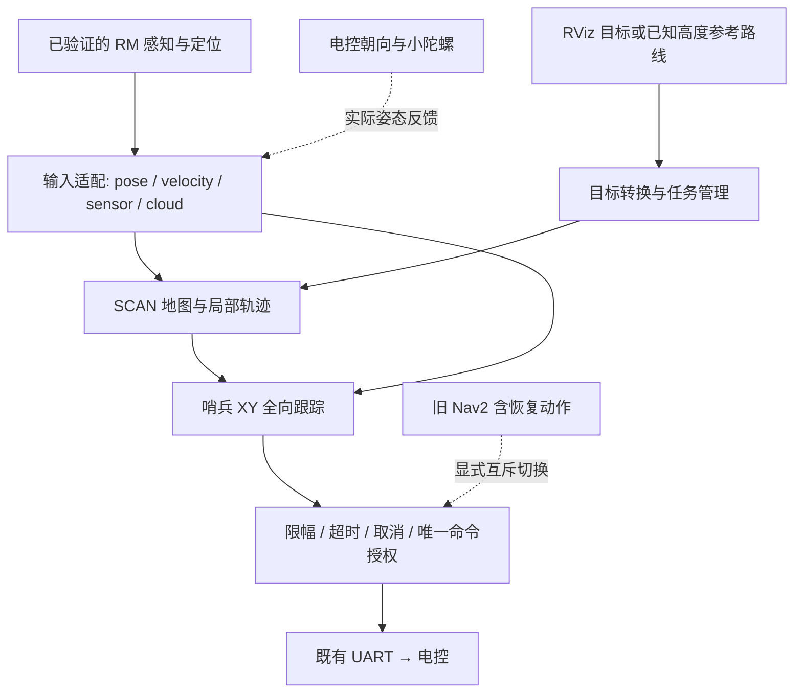

# C 方案目标架构

2026-10-07 更新：下文首期仿真交付已有实施，用户现暂停扩建仿真。
当前按[实车影子接入交接](../migration/real_robot_handoff.md)推进 I1/I2；
本页保留 C 分层设计，旧“本轮未授权代码修改”只描述当时文档轮，不否定本工作区已有实施。
RM 参考仍只读，硬件运行/最终命令接管未获授权。

状态：**方向已获用户认可；本轮完成规划，未授权执行导航代码修改或实车测试。** 具体参数、包名和内部接口仍是 PROPOSED。

## 目标与边界

“三维导航”采用 [SCAN 当前实现](scan_planner.md)：三维占据与碰撞检查、参考高度约束的局部轨迹、XY 执行，不要求自由 z 优化或完整轮式地形规划。此前把地形/拓扑全局搜索、轮地接触约束列为必做前置的建议已撤回。

现有 RM 是用户已验证可通过 RViz 2D goal 规划和行驶的基线。保留 LIO、registration、TF 与串口协议；静态接口疑点用于适配核对，不据此先重构已工作的链。小陀螺/朝向部分归电控，主机仓库的相关分支不代表实际执行路径。

## 当前先交付什么

DeepSeek harness 先实现独立 SCAN 全向版本：Mode 1 RViz 目标、Mode 2 参数航点、Mode 3 参考路线全部保留；用户 PCD → 局部观测 → SCAN → 全向速度 → 运动模拟器 → odom 构成闭环，RViz 显示地图、车体朝向/包络与计划/执行轨迹。优先测试固定车头横移和边转边走，不以直接发布样条位姿的 open loop 代替跟踪验证。

独立代码和仿真交付后先由 Codex 审查，再开始接入 VI_26_Sentry。下图描述的是后续实车目标，不是第一步就接 UART。

## 方案选择

| 方案 | 定位 | 当前决定 |
|---|---|---|
| A：一次替换 Nav2 全套职责 | 同时迁移任务、规划、执行、恢复 | 不作为首期 |
| B：Nav2 全局路径接 SCAN 局部 | 可选对照/过渡 | 不作为 C 的必经依赖 |
| C：目标/参考路线 + SCAN 空间避障 + 哨兵全向执行 | 分层适配、逐步替换 | 用户认可；不再附加完整地形全局规划要求 |

影子模式不接 UART，最终命令授权默认关闭。旧 Nav2 的 controller 与 behavior 等全部发速度者都必须隔离，不能仅停 controller 就宣布互斥。

## 最终接车职责（独立仿真审查之后）

- 输入 adapter：保留原话题/TF，另提供 SCAN 所需的统一坐标和有效线速度；新开启的高频 odom 是候选，不直接改 header 连接。
- 目标/路线 adapter：Mode 1 对齐 RViz 单目标；Mode 3 使用已知可行 xyz 参考路线，明确地面高度与 body_height，暂不开发全局地形搜索。
- SCAN：保留三种模式及原参考高度能力；允许全向适配所需的局部碰撞/优化代价/FSM/姿态/控制修改。后续 RM 专用入口不带 Go2 模型或模拟 odom，独立仿真入口则明确启动运动模拟器。
- XY follower：使用实际姿态与经确认的底盘命令坐标系；不等待底盘对齐轨迹切线，不接管 MCU 的旋转策略。
- 保护与任务层：有效输入门控、轨迹时序、取消/抢占/失败停止、限幅与单一命令来源。原生 SCAN topics 不等于这些契约已具备。
- 竞赛决策：首期不改独立 BT；之后再迁移 ComputePathToPose/FollowPath 和 footprint 依赖。

碰撞包络需覆盖横移/自转实际外形，首版建议全朝向保守包络；允许必要的局部碰撞代码适配。读取当前 odom yaw 不等于获知未来轨迹朝向；碰撞代价、安全检查与显示须一致。不修改固件。

详细工作项、接口草案、阶段门槛和回退见 [实施计划](../migration/plan.md)。
