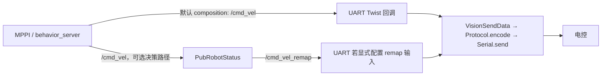

# 底盘命令与全向约束

证据：R3/R5/R10/R11/R14；`RM/src/hnurm_uart/src/Serial/Serialcodec.cpp`、`src/Protocol/protocol.cpp`；`hnurm_interfaces/msg/uart/VisionSendData.msg`。

用户确认小陀螺等部分功能由电控实现，仓库相关代码未必执行。下表仅描述静态分支，不据 spin_ctrl 或 angular.z 推断实车不能旋转。现有 RViz 目标导航已由用户实车验证。

## 两种实际链路

C++ 声明 twist_topic 默认 `/cmd_vel_remap`，但 `hnurm_uart.launch.py` 实际加载的 `params/default.yaml` 将其覆盖成 **`/cmd_vel`**。因此不能把决策中继画成默认必经节点。`PubRobotStatus::remap_cmd_vel_callback` 在 is_init_ 后原样转发；它有初始化门槛。

非 composition 的 controller 发布 `/cmd_vel_nav`，但该分支没有 velocity_smoother；配合默认 UART `/cmd_vel` 会缺控制器输出连接。behavior_server 的 cmd_vel 未做同样重映射。是否有外部桥接 UNKNOWN。

## Twist 实际解释

| 输入/状态 | 串口字段行为 | 含义 |
|---|---|---|
| Twist.linear.x | float → vel_x | 不做坐标旋转/单位缩放 |
| Twist.linear.y | float → vel_y | 支持独立横向值；最终电控轴定义 UNKNOWN |
| Twist.angular.z | 此回调未读取 | 不能把标准 yaw-rate 控制直接接通 |
| Twist.linear.z 且 is_in_special_area | vel_yaw，control_id=25 | 自定义重用；不是垂直速度 |
| enable_scan_control 且非特殊区 | scan_center_angle → vel_yaw，control_id=25 | 扫描角度语义，不能默认为 rad/s |
| spin_control_value | 先写入后被 `spin_ctrl=3.0` 覆盖 | msg 注释 1顺/2逆/3stop；是否与电控固件一致 UNKNOWN |
| cached_gesture | gesture | 来自 decision 的控制状态 |

普通分支没有把 angular.z 传给 vel_yaw，消息默认值不能替代协议确认。视觉回调还以 2000.0 写入速度字段作特殊值；这些值在电控的处理与超时策略需要协议/固件证据。

`Protocol::encode` 将 pitch、yaw、vel_x、vel_y、vel_yaw、control_id、spin_ctrl 放入 float 数组，附标志与 CRC；`SerialCodec::send_data` 直接编码后发送。底盘最终收到的是**自定义串口帧**，不是 ROS Twist。`ChassisCmd.msg` 虽存在，但不是所读 UART 的速度输入接口。

## 速度/加速度限制

| 层 | 源码/配置值 | 可确认程度 |
|---|---|---|
| Nav2 选中 MPPI FollowPath | vx [-1,1]、|vy|≤1、|wz|≤1.5，100 Hz | CONFIRMED 配置；运行版本支持/效果未测 |
| MPPI 加速度 | 选中配置未显式给出完整 ax/ay 上下限 | UNKNOWN 依赖实现默认值；勿引用未选 DWB 的 acc_lim |
| velocity_smoother | max_velocity [2,2,10]；min [-1.6,-1.6,-10]；max_accel [0.5,0.5,10]；max_decel [-0.7,-0.7,-10] | 有 YAML，但未加入生命周期名单，默认接线也不串联 controller；不能视作已生效 |
| SCAN trajectory | max_vel .75、max_acc .5 | 轨迹约束 |
| SCAN closed loop | max_vx .75、max_vy .35、max_vyaw 1 | 最终速度限幅；未见同等最终命令加速度限幅 |
| UART | 此 Twist 回调未见有限值检查、速度限幅、指令超时归零 | 上位机本段无保证；电控实现 UNKNOWN |

## 初次适配的建议边界（PROPOSED）

先让 SCAN 仅输出轨迹/影子速度。后续单独评审 command adapter：机身轴定义、云台与底盘 yaw 的所有权、vx/vy 旋转、速度/加速度限幅、输入超时、取消任务、急停、单一命令源。禁止简单把 SCAN `/cmd_vel` 与 RM 默认同名话题连通。

SCAN 的“先转向再平移”依赖 angular.z 真正控制朝向；RM 当前不转发它，可能一直处在冻结执行状态。即使改 yaw 输出，也要同时确认轨迹切线碰撞模型是否适用于横移/旋转的实际机身。

C 方案默认保留电控朝向/小陀螺职责；新增 XY 跟踪器不能强制先对齐路径 yaw。命令坐标转换以实际底盘协议轴定义为准；不是简单删除 yaw 输出就完成适配。

需要用户/电控后续确认：vel_x/y 的参考系与单位、vel_yaw 的各模式单位、control_id=25 和 2000 特殊值、spin_ctrl=3、固件 watchdog、机器人尺寸与当前场地运动上限。当前全部保留 UNKNOWN，不在此轮修改协议。
