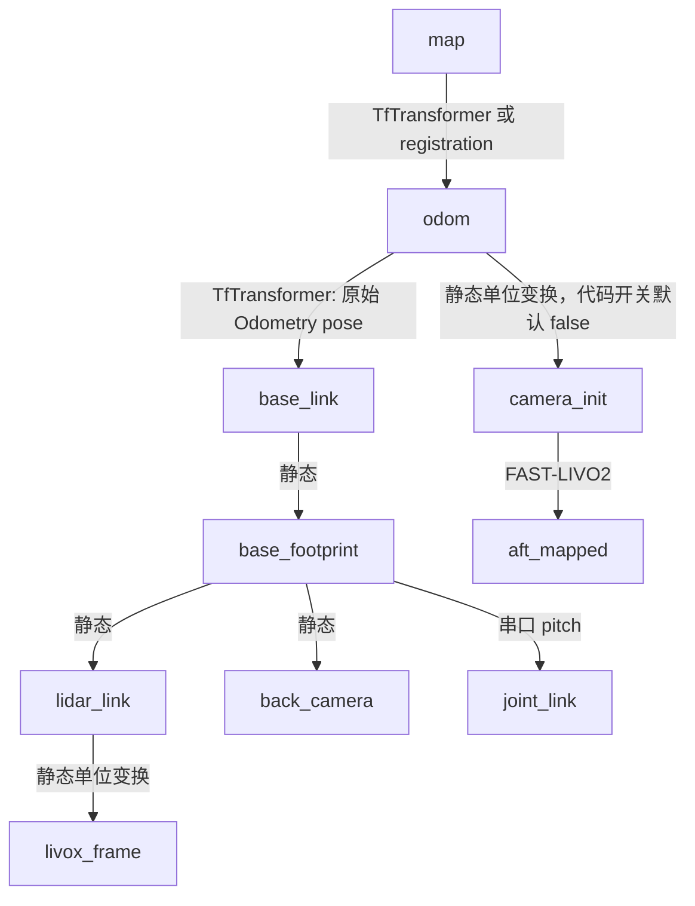

# TF 与位姿契约

基线：RM main；证据 R6/R7/R8、`hnurm_bringup/params/extrinsic.yaml`、对应头文件。这里是源码广播图，不是实测 TF 树。

## 广播表

| parent → child | 发布者/函数 | 位姿来源 | 类型与频率 |
|---|---|---|---|
| camera_init → aft_mapped | LIVMapper::publish_odometry | `_state.pos_end/rot_end` | 动态，每次发布 odometry；频率依输入/处理，UNKNOWN |
| odom → base_link | TfTransformer::odom_callback | 原 `/Odometry.pose`，仅重用数值 | 动态，随 /Odometry；stamp 沿用输入 |
| base_link → base_footprint | TfTransformer::timer_callback | `-lidar_to_base.xyz`，旋转单位 | 静态，第一次 10 ms timer 回调发后停止 |
| base_footprint → lidar_link | 同上 | `lidar_to_base.xyz`，旋转单位 | 静态 |
| lidar_link → livox_frame | 同上 | 单位变换 | 静态 |
| base_footprint → back_camera | 同上 | `back_camera_to_base.xyz`，yaw=-π | 静态 |
| base_footprint → joint_link | TfTransformer::recv_data_callback | `joint_to_base.xyz`；pitch=-msg.pitch×π/180 | 动态，随串口消息，stamp=now |
| odom → camera_init | TfTransformer::timer_callback | 单位变换 | 静态，`!use_relocalization` 时；成员默认 false，未见从参数读取 |
| map → odom（初始化） | TfTransformer::timer_callback | 阵营预置（红蓝都单位）或 initial_pose_guess | 100 Hz，需 is_self_color_set 且 !is_relocating |
| map → odom（配准） | RelocationNode::tf_pub_timer_callback / 配准成功路径 | `pre_result_ = result.T_target_source` | timer 17 ms，另有成功后发布；stamp=now |

本次更新已删除 hnurm_robot_description，bringup.launch.py 也不再启动 robot_state_publisher。camera_link、camera_optical_frame 与独立 imu frame 的最终运行连接为 **UNKNOWN**，不能补一条想象的 base→imu。

用户已验证现有导航可运行。下列内容是新消费者 SCAN 的契约核对项，不是对现有实车可用性的否定，也不授权修改现有 TF。

## 已发现的契约问题

1. **CONFIRMED：主里程计没有有效 twist 赋值。** R6 `publish_odometry` 写 pose；`odomAftMapped` 全源码引用未见 twist 写入。R7 原样复制 msg.twist；因此 `/Odometry_transformed` 也不能凭类型当作速度反馈。
2. **CONFIRMED：坐标组合形式值得修正评审。** R7 取 T_lidar_base，再 `doTransform(odom2base_link, ..., transform)`。改变运动刚体的参考点应检查 `T_odom_base = T_odom_lidar × T_lidar_base`，当前通用 pose 变换是左乘形式。INFERRED：非零偏航时可能出现杆臂方向错误。需要旋转+平移样例验证，尚未修改。
3. **CONFIRMED：frame 被解释/改名。** camera_init/aft_mapped 数值被当成 odom/base_link。单位 odom→camera_init 掩盖了一部分差异；传感器/IMU 原点与机身原点是否准确对应还需核实 LIO 状态定义及外参。
4. **CONFIRMED：map→odom 交接不是定位有效性协议。** registration timer 在初始化阶段也运行；状态 timer 发布 true；TfTransformer 一旦 is_relocating=true 就提前返回后续状态回调，无法根据 false 自动恢复。不能把 Bool 当“定位已收敛”。
5. `frame_names` 未包含 joint_to_base，但随后从 map 取该项；本次更新已将配置 `row` 修正为 `roll`，不再列为拼写缺口。外参加载需要核对，不据 YAML 断言 joint_link 平移为配置的 0.081。
6. 历史 URDF 重复链风险不再作为当前源码问题：该包已删除。未来 SCAN 入口仍不能照搬 Go2 模型并引入竞争 TF。
7. `/initialpose` 回调把地图机器人位姿直接存为 map→odom；非原点初始化时是否需要扣除 odom 中机器人位姿，当前未处理/验证。

## 时间与 frame 原则（PROPOSED）

未来 adapter 明确选择一个规划坐标系，分别定义：机身位置、传感器射线起点、点云、速度和路线。使用采样时刻的 TF，拒绝超时/缺失变换；不能只把 header 改成 map/world。

推荐先讨论 **odom 作为局部连续规划系、map 作为路线/任务系**。这是候选设计；SCAN 可视化有硬编码 world/map，Bspline 无 frame，需显式接口约定或显示适配。重定位跳变时需规定路径重投影/轨迹失效策略。

SCAN 原生发布 `grid_map.frame_id → sliding_map`（S4 `publishSlidingMapTF`）；这仅是地图滑窗显示关系，不负责 RM 定位链。不能把 simulation 的 world→base 并入实车 TF 当作定位结果。

任何后续 TF 修改必须在本表记录 parent、child、publisher、位姿来源、频率、时间戳与修改原因，并检查单一发布者及无环性。
